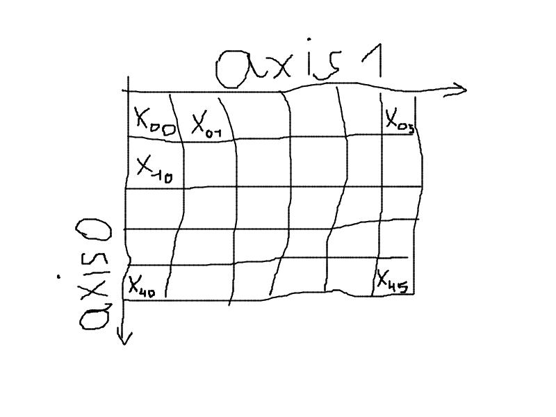

# Biblioteki Pythona w analizie danych

## Tomasz Rodak

Wykład 1

---

Literatura:

- [Dokumentacja NumPy](https://numpy.org/doc/stable/)
- [From Python to NumPy](https://www.labri.fr/perso/nrougier/from-python-to-numpy/) Nicolas P. Rougier, 2017.
- [PRML](https://www.microsoft.com/en-us/research/uploads/prod/2006/01/Bishop-Pattern-Recognition-and-Machine-Learning-2006.pdf) Christopher M. Bishop, "Pattern Recognition and Machine Learning", 2006.
- [PML-1](https://probml.github.io/pml-book/) Kevin P. Murphy, "Probabilistic Machine Learning: An Introduction", 2022.

# NumPy

Dokumentacja: [https://numpy.org/doc/stable/](https://numpy.org/doc/stable/)

Biblioteka do przetwarzania numerycznego dużych wielowymiarowych tablic liczbowych. 

Typowy import:


```python
import numpy as np
```

## Cechy NumPy

### Przetwarzane obiekty

* **Obiekty typu `ndarray`** - tablice wielowymiarowe, w których wszystkie elementy są ustalonego typu (homogeniczne)
* **Uniwersalne funkcje (`ufuncs`)** - funkcje, które przenoszą operacje na tablicach na poziom elementów tablicy

### Mechanizmy wykorzystywane w NumPy

* **Indeksacja:** Umożliwia selektywny dostęp do elementów tablicy. Obejmuje standardowe wycinanie (*slicing*) względem dowolnych osi zwracające widoki (*views*) oraz tzw. indeksowanie zaawansowane (*fancy indexing*) zwracające kopie.

* **Wektoryzacja:** Polega na wykonywaniu operacji matematycznych na całych tablicach, bez konieczności stosowania pętli. Dzięki temu operacje są znacznie szybsze i bardziej czytelne, wykorzystując niskopoziomowe optymalizacje.

* **Broadcasting:** Mechanizm, który umożliwia operacje arytmetyczne na tablicach o różnych kształtach. Mniejsze tablice są „rozszerzane” (broadcasted) do rozmiarów większych.

## `np.ndarray`

Główny typ definiowany przez bibliotekę Numpy.

* Reprezentuje jedno lub wielowymiarową tablicę wartości. Jest to podstawowa klasa definiowana przez bibliotekę.
* Wszystkie wartości w tablicy muszą być tego samego typu, czyli `np.ndarray` jest tablicą jednorodną (homogeniczną).
* Każda wartość zajmuje tę samą określoną przez typ porcję pamięci.

## `np.array()`

Tworzy tablice z ["tablicopodobnych"](https://numpy.org/doc/stable/user/basics.creation.html?highlight=array_like) obiektów, np. z list:


```python
a = np.array([[1, 2, 3], [7, 8, 9]])
a
```


    array([[1, 2, 3],
           [7, 8, 9]])


## `dtype`

Wspólny typ dla wszystkich wartości w tablicy:


```python
a = np.array([1, 2, 3])
a.dtype
```


    dtype('int64')


```python
a = np.array([1.5, 2, 3.14])
a.dtype
```


    dtype('float64')


## NumPy: typy wbudowane

Data type |Description
---|---
bool_ |Boolean (True or False) stored as a byte
int_ |Default integer type (same as C long; normally either int64 or int32)
intc |Identical to C int (normally int32 or int64)
intp |Integer used for indexing (same as C ssize_t; normally either int32 or int64)
int8 |Byte (-128 to 127)
int16 |Integer (-32768 to 32767)
int32 |Integer (-2147483648 to 2147483647)
int64 |Integer (-9223372036854775808 to 9223372036854775807)
uint8 |Unsigned integer (0 to 255)
uint16 |Unsigned integer (0 to 65535)
uint32 |Unsigned integer (0 to 4294967295)
uint64 |Unsigned integer (0 to 18446744073709551615)
float_ |Shorthand for float64.
float16 |Half precision float: sign bit, 5 bits exponent, 10 bits mantissa
float32 |Single precision float: sign bit, 8 bits exponent, 23 bits mantissa
float64 |Double precision float: sign bit, 11 bits exponent, 52 bits mantissa
complex_ |Shorthand for complex128.
complex64 |Complex number, represented by two 32-bit floats
complex128 |Complex number, represented by two 64-bit floats

## Atrybuty tablic

* **`.ndim`** -- liczba wymiarów, liczba całkowita.
* **`.shape`** -- rozmiar każdego z wymiarów, krotka liczb całkowitych.
* **`.size`** -- całkowita liczba wartości, iloczyn wartości z krotki `.shape`.

<center>

</center>

## [Tablice stałe](https://numpy.org/doc/stable/reference/routines.array-creation.html#ones-and-zeros)

Tablice stałe to tablice, które mają wszystkie elementy ustawione na tę samą wartość. NumPy dostarcza kilka funkcji do tworzenia takich tablic:

* **`np.zeros()`** – tworzy tablicę wypełnioną zerami.
* **`np.ones()`** – tworzy tablicę wypełnioną jedynkami.
* **`np.full()`** – tworzy tablicę o określonym kształcie, wypełnioną podaną wartością.
* **`np.eye()`** – generuje macierz, w której elementy na głównej przekątnej są jedynkami, a pozostałe zerami.
* **`np.identity()`** – zwraca kwadratową macierz jednostkową (tożsamościową).
* **`np.*_like()`** – funkcje (np. `np.zeros_like()`, `np.ones_like()`, `np.full_like()`) tworzą tablice o tym samym kształcie i typie danych, co podana tablica, ale wypełnione zerami, jedynkami lub inną wartością.

## Definiowanie tablicy o zadanym kształcie

Podane wyżej funkcje, jak i wiele innych generujących tablice, przyjmują argument `shape` (czasem `size`, np. `np.random.normal()`), który określa kształt tablicy wynikowej. 

Pouczającym ćwiczeniem jest próba własnej implementacji funkcji generującej tablicę w postaci listy list o zadanym kształcie. Oto przykład implementacji funkcji `np.full()`: 


```python
def f(shape, fill=0):
    '''Zwraca tablicę o kształcie shape wypełnioną wartością fill.'''
    if len(shape) == 0:
        return fill
    else:
        a, *q = shape
        return a * [f(q, fill)]
```

Oczywiście, w praktyce nie ma potrzeby implementowania takich funkcji, ponieważ NumPy dostarcza gotowe, zoptymalizowane implementacje. Tym niemniej tego typu zadania stanowią dobry trening zdolności programistycznych.

## [Tablice z danych](https://numpy.org/doc/stable/reference/routines.array-creation.html#from-existing-data)

* **`np.array()`** – Konwertuje dane wejściowe (np. listy, krotki) na tablicę ndarray.
* **`np.asarray()`** – Podobnie jak `np.array()`, ale nie kopiuje danych, gdy już są tablicą NumPy.
* **`np.copy()`** – Tworzy głęboką kopię tablicy, co zapewnia niezależność oryginału i kopii.
* **`np.fromfile()`** – Wczytuje dane binarne z pliku, tworząc z nich tablicę.
* **`np.fromfunction()`** – Generuje tablicę na podstawie funkcji, która jest wywoływana dla każdego indeksu.
* **`np.fromiter()`** – Tworzy tablicę z dowolnego iterowalnego obiektu, np. generatora.
* **`np.fromstring()`** – Konwertuje dane zawarte w łańcuchu znaków na tablicę, dzieląc tekst według separatorów.
* **`np.loadtxt()`** – Ładuje dane tekstowe z pliku do tablicy, przydatne przy pracy z danymi zapisanymi w formacie tekstowym.

## [Tablice zakresów liczbowych](https://numpy.org/doc/stable/reference/routines.array-creation.html#numerical-ranges)

* **`np.arange()`** – Generuje tablicę z wartościami o stałym kroku, podobnie jak funkcja `range()`, ale zwraca obiekt `ndarray`.
* **`np.linspace()`** – Zwraca tablicę z określoną liczbą równomiernie rozmieszczonych wartości w zadanym przedziale.
* **`np.logspace()`** – Tworzy tablicę wartości rozmieszczonych równomiernie na skali logarytmicznej.
* **`np.geomspace()`** – Generuje tablicę wartości rozmieszczonych równomiernie w skali geometrycznej (iloczynowo).
* **`np.meshgrid()`** – Tworzy siatkę współrzędnych na podstawie podanych wektorów; umożliwia przygotowanie danych do wizualizacji lub obliczeń na wielowymiarowych funkcjach.

### Użycie `np.linspace()` do generowania punktów na wykresie

Funkcje rysujące wykresy, np. `matplotlib.pyplot.plot()` czy `seaborn.lineplot()`, pobierają współrzędne punktów z tablic dla poszczególnych osi. Zatem jeśli chcemy narysować wykres funkcji na płaszczyźnie, to musimy dostarczyć dwie tablice: jedną ze współrzędnymi x, drugą ze współrzędnymi y. Funkcja `np.linspace()` pozwala na wygodne generowanie tablicy 1D z równomiernie rozmieszczonymi punktami na zadanym przedziale. W ten sposób możemy wygenerować tablicę z punktami na osi x, a następnie obliczyć wartości funkcji dla tych punktów i zapisać je w tablicy z punktami na osi y.


```python
from matplotlib import pyplot as plt
%matplotlib inline

# Rysujemy wykres funkcji f(x) = x * sin(x)
n = 100 # liczba argumentów funkcji
x = np.linspace(0, 10, n) # generujemy n równo rozmieszczonych punktów na odcinku [0, 10]
y = x * np.sin(x) # obliczamy wartości funkcji f w tych punktach
plt.plot(x, y); # rysujemy wykres
```


    

    


### Użycie `np.meshgrid()` do generowania siatki punktów 

Aby narysować wykres funkcji $z=f(x,y)$ na płaszczyźnie postępujemy podobnie jak w przypadku rysowania wykresu funkcji jednej zmiennej. Tym razem jednak potrzebujemy tablic z punktami na osi x i y oraz tablicę z wartościami funkcji dla tych punktów.
Do wygenerowania tablic argumentów x i y możemy użyć funkcji `np.linspace()` i `np.meshgrid()`. Funkcja `np.meshgrid()` przyjmuje jako argumenty dwie tablice z punktami na osi x i y, a zwraca dwie tablice 2D, w których elementy to współrzędne punktów.

Dokładniej działa to tak: jeśli `x` to tablica z punktami na osi x, a `y` to tablica z punktami na osi y, to `X, Y = np.meshgrid(x, y)` zwraca dwie tablice `X` i `Y` takie, że
* `X[i, j]` to `x[j]`, 
* `Y[i, j]` to `y[i]`.

Gdy mamy `X` i `Y`, to możemy obliczyć wartości `Z` wstawiając `X` i `Y` do `f()`: `Z = f(X, Y)`. 

Demonstracja działania `np.meshgrid()` na przykładzie funkcji $f(x,y)=xy$ w prostokącie $[1,4]\times[1,3]$:


```python
x = [1, 2, 3, 4]
y = [1, 2, 3]
X, Y = np.meshgrid(x, y)
Z = X*Y
print(X)
print(Y)
print(Z)
```

    [[1 2 3 4]
     [1 2 3 4]
     [1 2 3 4]]
    [[1 1 1 1]
     [2 2 2 2]
     [3 3 3 3]]
    [[ 1  2  3  4]
     [ 2  4  6  8]
     [ 3  6  9 12]]


Wykres konturowy funkcji $f(x,y)=y^2-x^2(1+x)$ w prostokącie $[-1,1]\times[-1,1]$:


```python
from matplotlib import pyplot as plt
%matplotlib inline

N = 100 # N**2 punktów na wykresie
x = np.linspace(-1, 1, N)
y = np.linspace(-1, 1, N)
X, Y = np.meshgrid(x, y)
Z = Y**2 - X**2*(1 + X)

fig, ax = plt.subplots(figsize=(10, 6))
cs = ax.contourf(X, Y, Z, levels=20, cmap='viridis')
fig.colorbar(cs)
ax.plot(x, x*np.sqrt(1 + x), 'black', label='$y^2 = x^2(1 + x)$')
ax.plot(x, -x*np.sqrt(1 + x), 'black')
ax.set(
    xlim=(-1, 1),
    ylim=(-1, 1),
    title='Wykres $f(x, y) = y^2 - x^2(1 + x)$ z zaznaczonymi miejscami zerowymi'
)
ax.legend();
```


    

    


## [Proste tablice wartości losowych](https://numpy.org/doc/stable/reference/random/generator.html#simple-random-data)

**Uwaga:** Od NumPy 1.17 zalecanym sposobem generowania liczb losowych jest nowe API oparte na generatorach. Zamiast `np.random.function()` używamy obiektu `Generator`:

```python
rng = np.random.default_rng(seed=42)  # powtarzalność wyników
rng.integers(0, 10, size=5)           # zamiast np.random.randint()
rng.random(size=5)                    # zamiast np.random.random()
rng.standard_normal(size=5)           # zamiast np.random.randn()
rng.choice([1, 2, 3], size=2)        # zamiast np.random.choice()
```

Stare API (`np.random.randint()`, `np.random.randn()`, ...) nadal działa, ale nowe jest zalecane ze względu na lepszą kontrolę stanu generatora i lepsze właściwości statystyczne (domyślny generator PCG64 zamiast Mersenne Twister).

Wybrane metody generatora:

* **`rng.integers(low, high, size)`** – Losowe liczby całkowite z przedziału $[\text{low}, \text{high})$.
* **`rng.random(size)`** – Wartości z rozkładu jednostajnego na $[0,1)$.
* **`rng.standard_normal(size)`** – Wartości z rozkładu normalnego $\mathcal{N}(0,1)$.
* **`rng.choice(a, size, replace, p)`** – Losowy wybór elementów z tablicy `a`.

## [Losowa zmiana porządku](https://numpy.org/doc/stable/reference/random/generator.html#permutations)

* **`rng.shuffle()`** – Miesza elementy tablicy „w miejscu” (in-place).
* **`rng.permutation()`** – Zwraca nową tablicę będącą losową permutacją elementów podanej tablicy. Jeśli podamy liczbę, funkcja wygeneruje permutację liczb od 0 do $n-1$, nie modyfikując oryginalnych danych.
* **`rng.permuted()`** – Działa podobnie jak `permutation()`, zwracając nową, permutowaną kopię tablicy, pozostawiając oryginał nietknięty.

## [Rozkłady](https://numpy.org/doc/stable/reference/random/generator.html#distributions)

* **`rng.normal(loc, scale, size)`** – Rozkład normalny (Gaussa) o zadanej średniej i odchyleniu standardowym.
* **`rng.uniform(low, high, size)`** – Rozkład jednostajny na zadanym przedziale.
* **`rng.exponential(scale, size)`** – Rozkład wykładniczy o zadanym parametrze.
* **`rng.poisson(lam, size)`** – Rozkład Poissona o zadanym parametrze $\lambda$.
* **`rng.binomial(n, p, size)`** – Rozkład dwumianowy o zadanym prawdopodobieństwie sukcesu i liczbie prób.
* itp.


```python
import seaborn as sns

rng = np.random.default_rng(seed=0)
N = 1000 ## Liczba losów

arr = rng.exponential(2, N)
sns.histplot(arr, kde=True);
```


    

    


## [Operacje macierzowe](https://numpy.org/doc/stable/reference/routines.linalg.html)

* **`np.dot()`** – Oblicza iloczyn skalarny lub mnożenie macierzy w zależności od wymiarów wejściowych.
* **`np.linalg.multi_dot()`** – Wydajnie oblicza iloczyn kilku macierzy, optymalizując kolejność mnożeń.
* **`np.vdot()`** – Liczy iloczyn wektorowy, traktując argumenty jako spłaszczone tablice (dla liczb zespolonych sprzęga pierwszy argument).
* **`np.inner()`** – Zwraca sumę iloczynów odpowiadających sobie elementów dwóch tablic.
* **`np.outer()`** – Oblicza iloczyn zewnętrzny dwóch wektorów, tworząc macierz.
* **`np.matmul()` oraz operacja `@`** – Wykonują mnożenie macierzy, obsługując zarówno operacje na macierzach 2D, jak i na tablicach o wyższych wymiarach.
* **`np.linalg.matrix_power()`** – Podnosi kwadratową macierz do zadanej potęgi przez kolejne mnożenia.

## [Równania liniowe](https://numpy.org/doc/stable/reference/routines.linalg.html#solving-equations-and-inverting-matrices)

* **`np.linalg.solve()`** – Rozwiązuje układ równań liniowych $Ax = b$ dla macierzy kwadratowej $A$, zwracając wektor $x$.
* **`np.linalg.tensorsolve()`** – Rozwiązuje równanie liniowe, w którym macierz $A$ jest zastąpiona przez tensor, przy odpowiednim określeniu osi.
* **`np.linalg.lstsq()`** – Znajduje rozwiązanie układu równań metodą najmniejszych kwadratów, przydatne przy układach nadokreślonych lub niedookreślonych.
* **`np.linalg.inv()`** – Oblicza macierz odwrotną dla danej macierzy kwadratowej, jeśli taka istnieje.
* **`np.linalg.pinv()`** – Wyznacza macierz pseudoodwrotną (Moore-Penrose).
* **`np.linalg.tensorinv()`** – Oblicza odwrotność tensora poprzez reinterpretację wielowymiarowej tablicy jako macierzy, z uwzględnieniem odpowiedniego rozbicia indeksów.

### Przykład: rozwiązywanie układu równań

Rozwiązujemy układ $Ax = b$:

$$\begin{cases} 2x + y = 5 \\ x + 3y = 7 \end{cases}$$

```python
A = np.array([[2, 1],
              [1, 3]])
b = np.array([5, 7])

x = np.linalg.solve(A, b)
x
```

    array([1.6, 1.8])

```python
# Weryfikacja: A @ x powinno dać b
A @ x
```

    array([5., 7.])

### Przykład: pseudoodwrotność (układ nadokreślony)

Gdy mamy więcej równań niż niewiadomych, `np.linalg.lstsq()` znajduje rozwiązanie w sensie najmniejszych kwadratów:

```python
# 3 równania, 2 niewiadome (układ nadokreślony)
A = np.array([[1, 1],
              [1, 2],
              [1, 3]])
b = np.array([1, 2, 2])

x, residuals, rank, sv = np.linalg.lstsq(A, b, rcond=None)
x
```

    array([0.5       , 0.5       ])

## Łączenie i dzielenie tablic

* **`np.concatenate()`** – Łączy tablice wzdłuż zadanego wymiaru.
* **`np.vstack()`** – Łączy tablice wzdłuż pierwszego wymiaru.
* **`np.hstack()`** – Łączy tablice wzdłuż drugiego wymiaru.
* **`np.split()`** – Dzieli tablicę na podtablice.
* **`np.vsplit()`** – Dzieli tablicę wzdłuż pierwszego wymiaru.
* **`np.hsplit()`** – Dzieli tablicę wzdłuż drugiego wymiaru.

## Funkcje agregujące

* **`np.sum()`** – Sumuje wartości w tablicy.
* **`np.min()`, `np.max()`** – Znajduje wartość minimalną lub maksymalną.
* **`np.mean()`** – Oblicza średnią arytmetyczną.
* **`np.median()`** – Znajduje medianę.
* **`np.std()`** – Oblicza odchylenie standardowe.
* **`np.var()`** – Oblicza wariancję.
* **i wiele innych ...**


## Wektoryzacja – przykład

Wektoryzacja polega na zastąpieniu jawnych pętli Pythona operacjami NumPy wykonywanymi na całych tablicach. Dzięki temu kod jest szybszy (operacje realizowane w skompilowanym C) i bardziej czytelny.

```python
# Porównanie: suma kwadratów elementów tablicy

a = np.arange(1_000_000, dtype=np.float64)
```

```python
%%timeit
# Pętla Pythona
total = 0.0
for x in a:
    total += x * x
```

    287 ms ± 5.12 ms per loop (mean ± std. dev. of 7 runs, 1 loop each)

```python
%%timeit
# Wektoryzacja NumPy
np.sum(a ** 2)
```

    1.23 ms ± 42.6 µs per loop (mean ± std. dev. of 7 runs, 1000 loops each)

W tym przykładzie wersja wektoryzowana jest ok. **200× szybsza** niż pętla Pythona.


## [Broadcasting](https://numpy.org/doc/stable/user/theory.broadcasting.html?highlight=broadcasting)

Operowanie na tablicach o różnych kształtach.

### Reguły broadcastingu

1. Jeśli dwie tablice różnią się wymiarem, to kształt tej o mniejszym wymiarze jest uzupełniany od lewej jedynkami.
2. Jeśli rozmiary na danej osi nie są w obu tablicach równe, to ten który jest równy jeden, jest rozszerzany do większego rozmiaru.
3. Jeśli rozmiary na danej osi nie są w obu tablicach równe i żaden z nich nie jest równy jeden, to broadcasting nie może zostać wykonany. Wtedy rzucany jest wyjątek.

### Zadanie

Na których kształtach da się wykonać broadcasting?

1. `(1, 2)` i `(3, 4, 2)`
1. `(1, 2)` i `(3, 2, 4)`
1. `(5, 3, 8)` i `(5, 4, 8)`
1. `(5, 3, 8)` i `(5, 8)`
1. `(5, 3, 8)` i `(3, 8)`
1. `(5, 3, 8)` i `(5, 3)`

### Przykład


Wykres funkcji $z=\sin(\exp(2x^2)) + \sin(\exp(2y^2))$ w kwadracie $[-1, 1]\times[-1, 1]$:


```python
x = np.linspace(-1, 1, 500)
y = np.linspace(-1, 1, 500)[:, np.newaxis]

z = np.sin(np.exp(2*x**2)) + np.cos(np.exp(2*y**2))
```


```python
from matplotlib import pyplot as plt
fig = plt.figure()
ax = fig.add_subplot(111, projection='3d')
ax.plot_surface(x, y, z, cmap='viridis');
plt.show()
```


    

    


## `np.tile()`

Funkcja `np.tile()` służy do tworzenia nowej tablicy przez powtarzanie istniejącej tablicy określoną liczbę razy wzdłuż każdego wymiaru. Pozwala na "kafelkowanie" (tiling) danych w uporządkowany sposób.

Składnia podstawowa:
```python
np.tile(A, reps)
```

Gdzie:
- `A` to tablica wejściowa (lub skalar)
- `reps` to liczba powtórzeń (pojedyncza liczba lub krotka określająca liczbę powtórzeń w każdym wymiarze)


```python
# Powtórz 1D tablicę 3 razy
a = np.array([1, 2, 3])
np.tile(a, 3)
```


    array([1, 2, 3, 1, 2, 3, 1, 2, 3])


```python
# Powtórz tablicę 2 razy wzdłuż pierwszego wymiaru i 3 razy wzdłuż drugiego
np.tile(a, (2, 3))
```


    array([[1, 2, 3, 1, 2, 3, 1, 2, 3],
           [1, 2, 3, 1, 2, 3, 1, 2, 3]])


Porównanie z broadcastingiem: `np.tile()` tworzy jawne kopie danych w pamięci, podczas gdy broadcasting operuje na widokach — w wielu przypadkach broadcasting jest więc bardziej efektywny pamięciowo niż `np.tile()`.


## [Indeksowanie](https://numpy.org/doc/stable/reference/arrays.indexing.html)

Korzysta ze zwykłej składni Pythona:

```
A[obj]
```

Od rodzaju `obj` zależy, czy indeksowanie będzie proste, czy złożone (*basic*/*advanced*).


## [Indeksowanie proste](https://numpy.org/doc/stable/reference/arrays.indexing.html#basic-slicing-and-indexing)

Zachodzi, gdy `obj` jest wycinkiem, liczbą całkowitą lub krotką wycinków i liczb całkowitych plus ewentualne `Ellipsis` i `np.newaxis`.

Kluczowe cechy:

* Zwraca widok oryginalnej tablicy, nie tworząc kopii danych.
* Umożliwia indeksowanie za pomocą liczb całkowitych lub wycinków dla każdego wymiaru.
* Operacje modyfikacji wykonane na zwróconym widoku wpływają na oryginalną tablicę.

## Indeksowanie złożone

`A[obj]` uruchamia indeksowanie złożone, gdy:
* `obj` jest sekwencją inną niż krotka, 
* `obj` jest tablicą NumPy o typie całkowitym lub logicznym,
* `obj` jest krotką z przynajmniej jedną sekwencją lub tablicą NumPy o typie całkowitym lub logicznym.

Wartość zwracana podczas indeksowania złożonego **jest kopią**.

## Indeksowanie i instrukcja przypisania

Oba rodzaje indeksowania można łączyć z instrukcją przypisania. Prowadzi to do modyfikacji oryginalnej tablicy.

```
A[obj] = v
```

<br>

Ale musi być możliwy *broadcast* `v` do kształtu `A[obj]`.

### Przykład: widok vs kopia

```python
a = np.array([10, 20, 30, 40, 50])

# Indeksowanie proste (wycinki) → widok
view = a[1:4]
view[0] = 999
a  # oryginał zmieniony!
```

    array([ 10, 999,  30,  40,  50])

```python
a = np.array([10, 20, 30, 40, 50])

# Indeksowanie złożone (lista indeksów) → kopia
copy = a[[1, 2, 3]]
copy[0] = 999
a  # oryginał niezmieniony
```

    array([10, 20, 30, 40, 50])

## Podsumowanie

W tym wykładzie omówiliśmy bibliotekę NumPy, która stanowi fundament ekosystemu naukowego Pythona. Najważniejsze zagadnienia to:

* Typ `ndarray` — homogeniczna tablica wielowymiarowa o ustalonym `dtype`.
* Tworzenie tablic — z danych, ze stałych, z zakresów liczbowych, z `meshgrid`.
* Wektoryzacja — operacje na tablicach zamiast pętli (rzędy wielkości szybsze).
* Broadcasting — reguły dopasowywania kształtów tablic w operacjach arytmetycznych.
* Indeksowanie — proste (widoki) vs złożone (kopie); kluczowe rozróżnienie przy modyfikacji danych.
* Algebra liniowa (`np.linalg`) — mnożenie macierzy, rozwiązywanie układów równań, pseudoodwrotność.

## Ćwiczenia

1. Utwórz tablicę 5×5 wypełnioną kolejnymi liczbami od 1 do 25. Wyodrębnij z niej podmacierz 3×3 środkowych elementów za pomocą wycinków. Sprawdź, czy wynik jest widokiem.

2. Bez użycia pętli, znormalizuj każdą kolumnę macierzy `A` (rozmiar $m \times n$) tak, aby miała średnią 0 i odchylenie standardowe 1. Wskazówka: użyj broadcastingu i `axis=0`.

3. Dana jest macierz $A$ rozmiaru $3\times 2$ i wektor $b$ długości 3. Znajdź wektor $x$ rozwiązujący układ $Ax \approx b$ w sensie najmniejszych kwadratów. Zweryfikuj wynik, porównując `A @ x` z `b`.